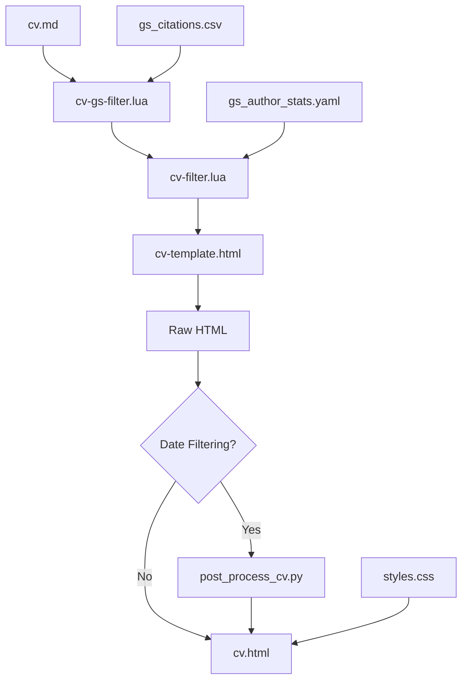

# Build Pipeline

This document explains how the Academic CV Generator transforms your Markdown source into a professional HTML CV.

## Overview

The build process involves multiple stages of processing, each handling different aspects of the CV generation:



## Stage-by-Stage Breakdown

### 1. Input Processing

**Input:** `cv.md` (Markdown with YAML front matter)

The build script (`build-cv.sh`) starts by:
- Parsing command-line arguments for date filtering
- Validating required files exist
- Setting up the Pandoc command with appropriate filters

### 2. Google Scholar Citation Integration

**Filter:** `cv-gs-filter.lua`
**Data Source:** `gs_citations.csv`

This stage processes `{GS:paper_id}` markers in the text:

```lua
-- Example transformation
{GS:abc123} → {GS:45}  -- where 45 is the citation count
```

**What happens:**
- Loads citation data from CSV file
- Replaces publication IDs with actual citation counts
- Warns about missing citations
- Preserves numeric values that are already citation counts

### 3. CV-Specific Formatting

**Filter:** `cv-filter.lua`
**Data Source:** `gs_author_stats.yaml`

This is the main formatting engine that handles:

#### Icon Generation
Converts publication type tags to visual icons:
```markdown
[peer-reviewed,journal] → 
[invited] → 
```

#### Date Filtering Logic
- Extracts years from `date` attributes
- Compares against filter ranges (if specified)
- Marks content for inclusion/exclusion

#### Special Formatting
- Converts author name markup (`**Author**`, `~~Collaborator~~`, `..External..`)
- Processes section containers (`.section-box`, `.media-item`)
- Handles line items and special styling

#### Content Counting
- Tracks publication and presentation counts
- Generates summary statistics
- Integrates Google Scholar author metrics

### 4. Template Application

**Template:** `cv-template.html`

Pandoc applies the HTML template, which:
- Injects the processed content into `$body$`
- Includes metadata (name, title, etc.)
- Embeds CSS and JavaScript
- Sets up the responsive layout structure

### 5. Post-Processing (Conditional)

**Script:** `post_process_cv.py`
**Condition:** Only when date filtering is applied

When date filtering is used, this script:
- Removes empty sections that have no matching content
- Cleans up orphaned headings
- Ensures the filtered CV maintains proper structure

### 6. Final Output

**Output:** `cv.html`

A complete, self-contained HTML file with:
- Embedded CSS styling
- JavaScript for dynamic features
- Professional typography and layout
- All icons and assets inlined

## Build Script Details

The `build-cv.sh` script orchestrates the entire process:

### Command Line Options

```bash
./build-cv.sh [--start-year YEAR] [--end-year YEAR]
```

### Pandoc Command Construction

The script builds a complex Pandoc command:

```bash
pandoc cv.md \
  --metadata filter_start_year=2020 \  # Optional
  --metadata filter_end_year=2023 \    # Optional
  --lua-filter=cv-gs-filter.lua \
  --lua-filter=cv-filter.lua \
  --template=cv-template.html \
  --metadata-file=gs_author_stats.yaml \
  --standalone \
  -f markdown-strikeout-subscript \
  -o cv.html
```

### Error Handling

The script includes comprehensive error checking:
- Validates Pandoc installation
- Ensures all required files exist
- Provides colored output for status updates
- Reports file size and build success

## Date Filtering Mechanics

### Year Extraction

The Lua filter uses regex patterns to find years:
```lua
-- Extracts 4-digit years
for year in text:gmatch("(%d%d%d%d)") do
  table.insert(years, tonumber(year))
end

-- Handles "present" as current year
if text:match("present") then
  table.insert(years, current_year)
end
```

### Range Overlap Logic

Content is included if its date range overlaps with the filter range:
```lua
-- Check for overlap: item_start <= filter_end AND item_end >= filter_start
return item_start <= filter_end_year and item_end >= filter_start_year
```

### Post-Processing Cleanup

The Python post-processor removes empty sections:
```python
# Removes sections with no visible content after filtering
def remove_empty_sections(html_content):
    # Complex regex to identify and remove orphaned headings
    # Preserves document structure while cleaning up
```

## Performance Considerations

### Build Speed
- Typical build time: 1-3 seconds
- Lua filters are highly optimized
- Minimal external dependencies

### Memory Usage
- Low memory footprint
- Streaming processing where possible
- Efficient string operations

### Caching
- Google Scholar data is cached in CSV files
- Template compilation is handled by Pandoc
- No explicit caching layer needed

## Customization Points

### Adding New Filters
1. Create new `.lua` file
2. Add `--lua-filter=your-filter.lua` to Pandoc command
3. Filters execute in the order specified

### Modifying Processing Logic
- **Citation handling**: Edit `cv-gs-filter.lua`
- **Formatting rules**: Edit `cv-filter.lua`
- **Template structure**: Edit `cv-template.html`
- **Build logic**: Edit `build-cv.sh`

### Debug Mode
Add debug output to Lua filters:
```lua
io.stderr:write("DEBUG: Processing element: " .. elem.t .. "\n")
```

## Troubleshooting Build Issues

### Common Build Failures

1. **Missing Pandoc**: Install from https://pandoc.org/installing.html
2. **Lua filter errors**: Check syntax in `.lua` files
3. **Template issues**: Validate HTML structure in `cv-template.html`
4. **Permission errors**: Ensure files are readable and output directory is writable

### Verbose Build Output

For debugging, you can modify the build script to show full Pandoc output:
```bash
# Add --verbose flag to Pandoc command
PANDOC_CMD="$PANDOC_CMD --verbose"
```

### Testing Filters Individually

Test Lua filters separately:
```bash
# Test Google Scholar filter only
pandoc cv.md --lua-filter=cv-gs-filter.lua -o test-gs.html

# Test CV filter only  
pandoc cv.md --lua-filter=cv-filter.lua -o test-cv.html
```
